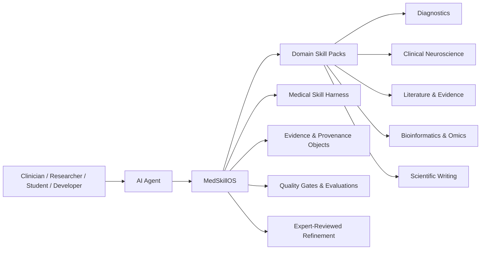

<div align="center">

# 🩺 MedSkillOS

### The open medical skill operating system for AI agents

**Medical-grade agent skills for clinical, biomedical, and scientific workflows.**

<br>

[](./LICENSE)


<br>

**MedSkillOS helps AI agents use medical knowledge, tools, datasets, and research workflows with structure, safety, provenance, and human review.**

<br>

[Overview](#-what-is-medskillos) ·
[Why it matters](#-why-medskillos) ·
[Architecture](#-architecture) ·
[Skill Directory](#-skill-directory) ·
[Install](#-quick-start) ·
[Contribute](#-contributing) ·
[Credits](#-acknowledgements--upstream-credit)

</div>

---

## ✨ What is MedSkillOS?

**MedSkillOS** is an open, agent-native framework for building and running **medical research skills**.

It is designed for AI agents that need to work across clinical reasoning, biomedical research, evidence synthesis, neurodata processing, bioinformatics, scientific writing, and medical workflow support.

MedSkillOS is not just a folder of prompts.

It is a standards layer for medical agents:

- reusable **domain skill packs**
- structured **input/output schemas**
- medical **safety and scope gates**
- evidence-aware **reasoning artifacts**
- reproducible **execution traces**
- quality-control **checklists and evaluations**
- expert-reviewed **improvement loops**

> **Goal:** turn general AI agents into safer, more useful, more reviewable medical and biomedical research collaborators.

---

## 🧭 Why MedSkillOS?

Medical AI is moving fast. We already have biomedical databases, clinical RAG systems, medical image tools, MCP servers, research assistants, and large collections of AI skills.

But most systems still optimize for **access**:

| Most tools focus on access to... | MedSkillOS focuses on assurance that... |
| --- | --- |
| PubMed, NCBI, FHIR, OMOP, DICOM, ClinicalTrials.gov | the right workflow was selected |
| guideline documents and biomedical databases | the input was valid and in scope |
| single-task scripts and utilities | safety gates were applied |
| generic medical explanations | uncertainty and limitations were stated |
| one-off prompt templates | provenance and evidence were recorded |
| large skill catalogs | outputs are reviewable and improvable |

MedSkillOS is built around a simple idea:

> **Medical agents should not only answer. They should show how they worked, what evidence they used, what they are uncertain about, and where human review is required.**

---

## 🧱 Architecture



MedSkillOS has four core layers.

### 1. Domain Skill Packs

Each medical domain is organized as a skill pack. A pack may contain agent-readable instructions, schemas, examples, risk boundaries, tests, and reviewer guidance.

Initial focus:

- `diagnostics` — structured clinical reasoning, differential diagnosis, red-flag detection, evidence mapping, and role-specific communication
- `clinical-neuroscience` — EEG, MEG, fMRI, source localization, spectral analysis, connectivity analysis, and neurophysiology reporting

Planned and expandable areas:

- literature review and evidence synthesis
- protocol and study design
- bioinformatics and omics analysis
- scientific writing and publication support
- pharmacology and drug safety
- radiology and pathology workflows
- public health and epidemiology
- medical education
- medical device and regulatory workflows

### 2. Medical Skill Harness

The harness runs, validates, audits, and evaluates skills.

It checks:

- input and output schemas
- parameter sanity
- safety boundaries
- evidence requirements
- quality-control artifacts
- provenance metadata
- deterministic tests
- regression evaluations
- human-review requirements

The goal is not only to run skills, but to make medical-agent workflows **reproducible, inspectable, and improvable**.

### 3. Evidence and Provenance Objects

MedSkillOS standardizes how agents represent evidence, reasoning, data-processing outputs, and review decisions.

Core objects may include:

- `ClinicalQuestion`
- `EvidenceObject`
- `SkillRunTrace`
- `ClinicalExperienceRecord`
- `ReviewDecision`

These objects help different skill packs communicate without collapsing everything into unstructured text.

### 4. Expert-Reviewed Self-Refinement

MedSkillOS supports learning from failures, reviewer comments, and user feedback — but not through uncontrolled automatic changes to medical logic.

Proposed improvements should pass:

- scope checks
- safety checks
- schema validation
- regression tests
- expert review
- versioned promotion

Skill maturity states:

```text
draft → candidate → experimental → reviewed → stable
                                      ↘ deprecated
```

---

## 📚 Skill Directory

MedSkillOS is designed as a growing medical skill registry. The directory should stay readable: the README highlights major domains, while the full catalog can live in `/docs`, `/skills`, or generated index files.

### 🩺 Diagnostics

Structured clinical reasoning skills that help agents reason clearly, surface missing information, and communicate safely.

<details>
<summary><strong>Example skills</strong></summary>

- `problem-representation`
- `red-flag-detection`
- `differential-diagnosis-builder`
- `evidence-for-against-mapper`
- `missing-information-identifier`
- `source-router`
- `evidence-grader`
- `doctor-summary`
- `nurse-handoff`
- `patient-explanation`
- `feedback-classifier`
- `reviewer-gate`

</details>

### 🧠 Clinical Neuroscience

Reproducible workflows for neurodata processing and reporting.

<details>
<summary><strong>Example skills</strong></summary>

- `validate-bids-dataset`
- `load-eeg-meg-raw`
- `inspect-raw-quality`
- `apply-notch-filter`
- `apply-bandpass-filter`
- `detect-bad-channels`
- `fit-ica-or-ssp`
- `generate-eeg-meg-qc-report`
- `run-fmriprep-wrapper`
- `inspect-fmriprep-outputs`
- `compute-psd`
- `compute-time-frequency`
- `run-source-localization`
- `compute-connectivity`
- `generate-neuro-report`

</details>

### 🔍 Literature & Evidence

Skills for finding, screening, appraising, and synthesizing biomedical literature.

<details>
<summary><strong>Example skills to add</strong></summary>

- biomedical search strategy builder
- PubMed query optimizer
- high-value paper screener
- evidence map generator
- contradiction resolver
- claim-to-paper verifier
- research gap finder
- reporting guideline matcher

</details>

### 🧪 Protocol & Study Design

Skills for turning research questions into executable medical research plans.

<details>
<summary><strong>Example skills to add</strong></summary>

- aim and hypothesis designer
- cohort protocol planner
- inclusion/exclusion criteria builder
- endpoint definition assistant
- sample size and power planner
- real-world evidence study designer
- biomarker validation strategy designer
- feasibility-aware study planner

</details>

### 🧬 Bioinformatics & Omics

Skills for reproducible analysis of molecular and biomedical datasets.

<details>
<summary><strong>Example skills to add</strong></summary>

- differential expression analysis
- batch effect correction
- GO/KEGG enrichment
- GSEA and GSVA
- WGCNA
- immune infiltration analysis
- survival modeling
- ROC and diagnostic performance
- single-cell analysis planning
- multi-omics integration

</details>

### ✍️ Scientific Writing

Skills for transforming research work into clearer scientific communication.

<details>
<summary><strong>Example skills to add</strong></summary>

- abstract builder
- method section writer
- results narrative builder
- discussion architect
- medical English precision editor
- journal matcher
- cover letter drafter
- reviewer response planner
- reporting guideline compliance checker

</details>

---

## 🗂️ Recommended Repository Layout

```text
MedSkillOS/
  README.md
  LICENSE
  NOTICE.md
  CONTRIBUTING.md

  skills/
    diagnostics/
      problem-representation/
        SKILL.md
        skill.yaml
        schemas/
        examples/
        tests/
        risk.md

    clinical-neuroscience/
      validate-bids-dataset/
        SKILL.md
        skill.yaml
        schemas/
        examples/
        tests/
        risk.md

  docs/
    catalog.md
    architecture.md
    safety-model.md
    contribution-guide.md
    third-party-notices.md

  evals/
    cases/
    rubrics/
    regression/

  schemas/
    ClinicalQuestion.schema.json
    EvidenceObject.schema.json
    SkillRunTrace.schema.json
    ReviewDecision.schema.json
```

A skill should define:

- what it does
- when to use it
- when **not** to use it
- required inputs
- expected outputs
- safety boundaries
- evidence requirements
- quality-control requirements
- provenance requirements
- known failure modes

---

## 🚀 Quick Start

> MedSkillOS is currently in early development. Directory names and install paths may change as the project matures.

Clone the repository:

```bash
git clone https://github.com/albertcheng19/MedSkillOS.git
cd MedSkillOS
```

Install selected skills into your agent framework:

```bash
# Example: install all available skills into a local agent skill directory
mkdir -p ~/.local/share/agent-skills
cp -r skills/* ~/.local/share/agent-skills/
```

For OpenClaw-style skill loading:

```bash
mkdir -p ~/.openclaw/skills
cp -r skills/* ~/.openclaw/skills/
```

For Claude-style local skills:

```bash
mkdir -p ~/.claude/skills
cp -r skills/* ~/.claude/skills/
```

Then ask your agent:

```text
What MedSkillOS skills are available, and when should each one be used?
```

---

## 🧪 Example Usage

```text
Use the differential-diagnosis-builder skill.

Patient summary:
- 45-year-old with new headache and transient visual symptoms
- no fever
- history of hypertension

Task:
Create a structured differential diagnosis, identify red flags,
list missing information, and clearly state when urgent clinical review is needed.
```

Expected MedSkillOS-style output:

```text
1. Problem representation
2. Red flags and immediate safety concerns
3. Differential diagnosis with evidence for/against
4. Missing information
5. Suggested source routing
6. Uncertainty and limitations
7. Human review requirement
```

---

## 🛡️ Safety and Scope

MedSkillOS is designed for:

- medical research
- biomedical data processing
- clinical workflow support
- medical education
- expert-reviewed agent development
- reproducible scientific workflows

MedSkillOS is **not**:

- a replacement for clinicians
- a diagnostic authority
- a treatment recommendation engine
- a scraped medical textbook
- a guideline mirror
- a general medical chatbot
- a marketplace of unverified tools

Medical outputs generated with MedSkillOS require appropriate human review.

---

## ✅ Quality Model

Every mature skill should pass two layers of review.

### Skill Quality

- clear trigger conditions
- explicit non-use cases
- structured input/output contract
- testable behavior
- reliable examples
- safe tool usage
- reproducible outputs

### Medical Quality

- scope boundaries
- uncertainty reporting
- evidence awareness
- clinical safety warnings
- source provenance
- reviewer handoff
- no unsupported medical authority claims

---

## 🧑‍🔬 Contributing

MedSkillOS welcomes contributions from:

- physicians
- nurses
- pharmacists
- clinical neuroscientists
- radiologists
- pathologists
- genetic counselors
- biomedical researchers
- medical students
- patients and caregivers
- software engineers
- evaluation designers
- safety and governance reviewers

You do not need to write code to contribute. Valuable contributions include:

- workflow designs
- skill drafts
- examples
- failure cases
- evaluation rubrics
- safety boundaries
- source-routing rules
- domain review comments
- documentation improvements

Suggested contribution flow:

```text
1. Propose a skill or improvement
2. Define scope and non-scope
3. Add examples and expected outputs
4. Add safety and evidence requirements
5. Add tests or evaluation cases
6. Request review
```

---

## 🧩 Acknowledgements & Upstream Credit

MedSkillOS builds on ideas, workflows, and open-source work from the medical AI skills community.

We gratefully acknowledge:

- [Aperivue / medsci-skills](https://github.com/Aperivue/medsci-skills)
- [FreedomIntelligence / OpenClaw-Medical-Skills](https://github.com/FreedomIntelligence/OpenClaw-Medical-Skills)
- [AIPOCH / medical-research-skills](https://github.com/aipoch/medical-research-skills)

Some skills, categories, workflow patterns, or documentation ideas in MedSkillOS may be derived from, adapted from, or inspired by these upstream projects.

When upstream content is copied or adapted:

- keep original copyright notices
- retain original license text where required
- document the source repository
- note meaningful modifications
- do not import files with unclear or incompatible licensing
- respect third-party content restrictions inside upstream repositories

Recommended notice file:

```text
docs/third-party-notices.md
```

---

## 📄 License

MedSkillOS is licensed under the [MIT License](./LICENSE).

Third-party content, adapted skills, bundled checklists, datasets, scripts, and examples may be subject to their own licenses. Their original licenses and attribution notices must be preserved.

---

## ⚕️ Medical Disclaimer

MedSkillOS is for research, education, workflow support, and expert-reviewed agent development.

It is not a validated clinical tool and must not be used as a replacement for qualified medical judgment, diagnosis, or treatment.

Always involve qualified professionals for clinical decisions.

---

<div align="center">

### Build safer medical agents. Share better research workflows. Make every skill reviewable.

If MedSkillOS helps your work, consider starring the repository ⭐

</div>
